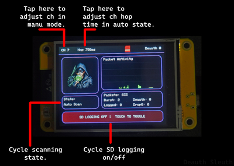
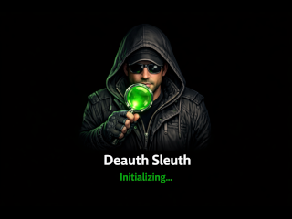
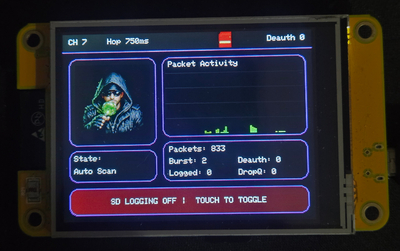
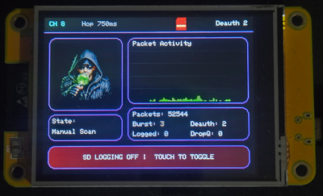
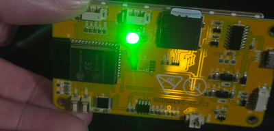

# 🔎 Deauth Sleuth v1.1


Deauth Sleuth is a touchscreen ESP32 Wi-Fi monitoring project for the **ESP32-2432S028R**. It watches nearby 802.11 traffic in promiscuous mode, highlights **deauthentication / disassociation activity**, monitors for possible **Evil Twin** behavior, and shows live status on the built-in TFT with custom graphics and touch controls. <br>
Flashing instructions & web flasher tool below.

# 🏗️ Project Images

<h3>UI Overview</h3>
<p align="center">
  
  
</p>

<p align="center">
  
  
  
</p>

# What it does

- Scans Wi-Fi traffic in **Auto Scan** or **Manual Scan**
- Detects **deauth** and **disassoc** management frames
- Shows live packet activity, channel, counters, and alert visuals
- Supports **touch control** for scan mode, channel, hop speed, and SD logging
- Logs detected deauth/disassoc events to **CSV on SD card**
- Passively monitors duplicate SSIDs for possible **Evil Twin** behavior
- Uses risk scoring based on security, BSSID/OUI, channel, RSSI, and when the duplicate first appeared
- Logs Evil Twin alerts to a separate **evil_twin_log.csv** file
- Uses custom image headers for normal scan, deauth alert, Evil Twin alert, capture, SD status, and splash screens
- Includes **RGB LED status feedback** for scan, alert, and SD write states (Green for scanning, Red for alerts, and Blue when logging.)

## 👥 Evil Twin detection

The Evil Twin detector passively learns nearby access points, then watches for duplicate SSIDs with suspicious differences. A duplicate SSID by itself is not treated as an attack because mesh systems, extenders, and multi-AP networks commonly share one network name.

Possible warning factors include:

- Different security type
- Different BSSID vendor/OUI
- Different channel
- Large RSSI difference
- A new duplicate appearing after the learning period
- Multiple BSSIDs suddenly using the same SSID

The on-screen status cycles between **Learn**, **Clear**, **Sus**, and **HIGH**. Alert sensitivity can be set to **Low**, **Balanced**, or **High** in `config.h`.

## 🎛️ Hardware / software

- **Board:** ESP32-2432S028R
- **Framework:** Arduino
- **ESP32 core:** 2.0.10
- **Display library:** TFT_eSPI
- **Touch input:** `TFT_eSPI getTouch()`

## 🎨🖌️ UI controls

- **State box:** toggle **Auto Scan / Manual Scan**
- **CH area:** step channel in **Manual Scan**
- **Hop area:** cycle hop presets in **Auto Scan**
- **Bottom SD button:** toggle SD logging on or off

Touch on this setup uses a mirrored X correction:
- `tx = (SCREEN_W - 1) - rawTx;`
- Y stays normal

## 🗄️ SD logging

When SD logging is enabled, detected deauth and disassoc events are written to `deauth_log.csv`. Evil Twin alerts are written separately to `evil_twin_log.csv`.

Current CSV fields:

- `millis`
- `channel`
- `type`
- `frame_subtype_hex`
- `rssi`
- `reason_code`
- `source_mac`
- `dest_mac`
- `bssid`

Example header:

```csv
millis,channel,type,frame_subtype_hex,rssi,reason_code,source_mac,dest_mac,bssid
```

This makes it easier to review captured events later in a spreadsheet or log viewer.

Evil Twin CSV fields include:

- `millis`
- `ssid`
- `risk_score`
- `state`
- `reasons`
- `known_bssid`
- `suspect_bssid`
- `known_channel`
- `suspect_channel`
- `known_rssi`
- `suspect_rssi`
- `known_security`
- `suspect_security`

Example Evil Twin header:

```csv
millis,ssid,risk_score,state,reasons,known_bssid,suspect_bssid,known_channel,suspect_channel,known_rssi,suspect_rssi,known_security,suspect_security
```

## ⚡️ Flashing in Arduino IDE

To flash this project in Arduino IDE, open the sketch and select **LOLIN D32** as the board.
Although the hardware target is the **ESP32-2432S028R (Cheap Yellow Display / CYD)**, this board option is used for compiling and uploading in Arduino IDE.

This project also relies on **TFT_eSPI**, so your display configuration must match the CYD hardware. A compatible **User_Setup** file has been included in the repo if needed. User-adjustable hardware, UI, scanner, logging, and sensitivity settings are stored in `config.h`.

Once the board and port are selected, compile and upload normally.

## Flashing with the Web Tool

To flash with the online tool, just visit the link below. <br>
<a href="https://atomnft.github.io/Deauth-Sleuth/flash0.html" target="_blank" rel="noopener noreferrer">
  
</a>